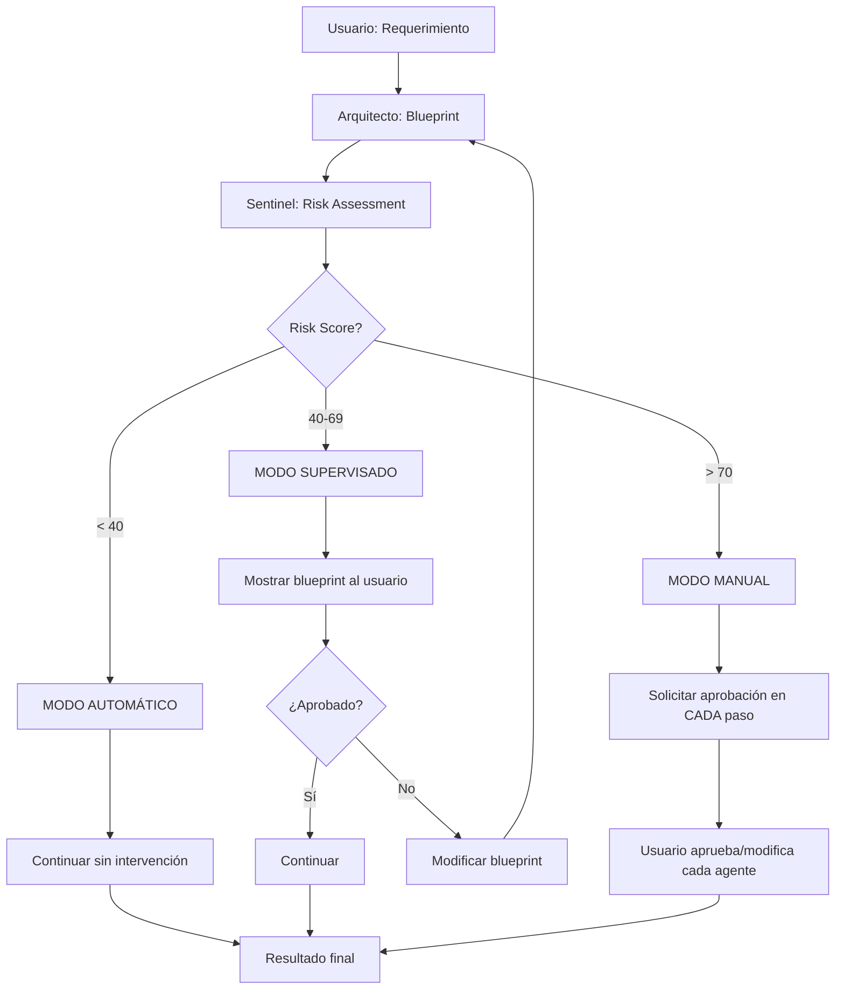

# HITL (Human-in-the-Loop) - Análisis Profundo y Casos de Uso

## 📋 ¿QUÉ ES HITL?

**Human-in-the-Loop (HITL)** es un patrón de diseño donde humanos intervienen en puntos críticos del flujo automatizado para:
- ✅ Validar decisiones importantes
- ✅ Corregir errores antes de que se propaguen
- ✅ Aportar conocimiento de dominio
- ✅ Aprobar cambios de alto riesgo

### Evidencia del Paper HULA (Ross et al. 2024)

**Hallazgos clave:**
- 82% de planes son aprobados por humanos
- 41% de planes requieren modificación humana
- -67% reducción en hallucinations
- -50% reducción en revisiones posteriores

**Conclusión:** HITL es CRÍTICO para calidad, pero debe ser **adaptativo** (no siempre necesario).

---

## 🎯 HITL ADAPTATIVO: 3 MODOS OPERACIONALES

### Concepto Central

El framework debe operar en **3 modos** según el **risk score** del Sentinel Agent:

```
Risk Score (0-100) → Modo Operacional → Intervención Humana
─────────────────────────────────────────────────────────
0-39 (LOW)          → AUTOMÁTICO      → ❌ No requerida
40-69 (MEDIUM)      → SUPERVISADO     → ⚠️ Aprobación de blueprint
70-100 (HIGH)       → MANUAL          → ✅ Aprobación en cada paso
```

### Flujo de Decisión



---

## 💡 CASOS DE USO DETALLADOS

### CASO 1: Calculadora Simple (Risk Score: 25 - LOW)

**Requerimiento:**
> "Crear una calculadora simple con operaciones básicas (+, -, *, /)"

**Flujo:**

1. **Arquitecto** genera blueprint:
   ```yaml
   name: simple_calculator
   type: cli
   components:
     - calculator_core (operaciones)
     - input_handler (validación)
     - output_formatter (display)
   ```

2. **Sentinel** evalúa riesgo:
   ```yaml
   impact: 15/100        # Bajo (no afecta datos críticos)
   complexity: 20/100    # Baja (lógica simple)
   sensitivity: 10/100   # Baja (no maneja datos sensibles)
   total_score: 16.5     # (15*0.4 + 20*0.3 + 10*0.3)
   level: LOW
   decision: auto_approve
   ```

3. **MODO AUTOMÁTICO activado:**
   - ✅ Framework continúa sin intervención
   - ✅ UI/UX Designer → Coder → Test Designer → Test Executor → Linter
   - ✅ Usuario recibe resultado final

**Intervención Humana:** ❌ NINGUNA

**Tiempo total:** ~2-3 minutos (completamente automatizado)

---

### CASO 2: Sistema de Gestión de Tareas (Risk Score: 55 - MEDIUM)

**Requerimiento:**
> "Crear un sistema de gestión de tareas (TODO app) con autenticación de usuarios, CRUD completo, y base de datos PostgreSQL"

**Flujo:**

1. **Arquitecto** genera blueprint:
   ```yaml
   name: todo_management_system
   type: web_app
   components:
     - auth_service (JWT, bcrypt)
     - task_api (CRUD endpoints)
     - database (PostgreSQL)
     - frontend (React)
   dependencies:
     - auth_service → task_api
     - task_api → database
   ```

2. **Sentinel** evalúa riesgo:
   ```yaml
   impact: 50/100        # Medio (afecta datos de usuarios)
   complexity: 60/100    # Media (autenticación + DB)
   sensitivity: 55/100   # Media (datos de usuarios)
   total_score: 54.5     # (50*0.4 + 60*0.3 + 55*0.3)
   level: MEDIUM
   decision: peer_review
   ```

3. **MODO SUPERVISADO activado:**
   
   **Paso 3.1: Framework muestra blueprint al usuario**
   ```
   ┌─────────────────────────────────────────────────────┐
   │ 🔔 APROBACIÓN REQUERIDA                             │
   ├─────────────────────────────────────────────────────┤
   │ Risk Score: 54.5 (MEDIUM)                           │
   │                                                      │
   │ Blueprint generado:                                 │
   │ - Sistema TODO con autenticación                    │
   │ - 4 componentes principales                         │
   │ - PostgreSQL como base de datos                     │
   │                                                      │
   │ Factores de riesgo:                                 │
   │ • Maneja datos de usuarios (sensibilidad media)    │
   │ • Requiere autenticación segura                     │
   │ • Complejidad media (4 componentes)                 │
   │                                                      │
   │ [Ver Blueprint Completo] [Aprobar] [Modificar]      │
   └─────────────────────────────────────────────────────┘
   ```

   **Paso 3.2: Usuario revisa y aprueba**
   - Usuario ve blueprint completo
   - Puede modificar componentes
   - Puede agregar restricciones
   - Aprueba para continuar

4. **Framework continúa automáticamente:**
   - ✅ UI/UX Designer (sin aprobación)
   - ✅ Coder (sin aprobación)
   - ✅ Test Designer (sin aprobación)
   - ✅ Test Executor (sin aprobación)
   - ✅ Linter (sin aprobación)

**Intervención Humana:** ⚠️ UNA VEZ (aprobación de blueprint)

**Tiempo total:** ~5 minutos (2 min automatizado + 3 min revisión humana)

---

### CASO 3: Sistema de Pagos con Stripe (Risk Score: 85 - HIGH)

**Requerimiento:**
> "Crear un sistema de procesamiento de pagos con integración de Stripe, manejo de webhooks, y almacenamiento de información de tarjetas"

**Flujo:**

1. **Arquitecto** genera blueprint:
   ```yaml
   name: payment_processing_system
   type: api
   components:
     - stripe_integration (API calls)
     - webhook_handler (eventos de Stripe)
     - payment_storage (DB con encriptación)
     - transaction_logger (audit trail)
   security:
     - PCI DSS compliance required
     - Encryption at rest
     - Secure API keys management
   ```

2. **Sentinel** evalúa riesgo:
   ```yaml
   impact: 95/100        # Muy alto (dinero real)
   complexity: 80/100    # Alta (integración externa + webhooks)
   sensitivity: 90/100   # Muy alta (datos financieros)
   total_score: 88.5     # (95*0.4 + 80*0.3 + 90*0.3)
   level: HIGH
   decision: human_approval
   ```

3. **MODO MANUAL activado:**

   **Paso 3.1: Aprobación de Blueprint**
   ```
   ┌─────────────────────────────────────────────────────┐
   │ ⚠️ APROBACIÓN CRÍTICA REQUERIDA                     │
   ├─────────────────────────────────────────────────────┤
   │ Risk Score: 88.5 (HIGH) ⚠️                          │
   │                                                      │
   │ ADVERTENCIA: Sistema de alto riesgo                 │
   │ - Maneja dinero real                                │
   │ - Datos financieros sensibles                       │
   │ - Requiere PCI DSS compliance                       │
   │                                                      │
   │ Blueprint:                                          │
   │ [Ver detalles completos...]                         │
   │                                                      │
   │ ¿Aprobar este blueprint?                            │
   │ [❌ Rechazar] [✏️ Modificar] [✅ Aprobar]           │
   └─────────────────────────────────────────────────────┘
   ```

   **Paso 3.2: Aprobación de UI/UX Design**
   ```
   ┌─────────────────────────────────────────────────────┐
   │ 🎨 Revisar Diseño UI/UX                             │
   ├─────────────────────────────────────────────────────┤
   │ UI/UX Designer ha generado:                         │
   │ - 3 wireframes                                      │
   │ - Flujo de pago de 5 pasos                          │
   │ - Validaciones de seguridad                         │
   │                                                      │
   │ [Ver Wireframes] [Aprobar] [Modificar]              │
   └─────────────────────────────────────────────────────┘
   ```

   **Paso 3.3: Aprobación de Código**
   ```
   ┌─────────────────────────────────────────────────────┐
   │ 💻 Revisar Código Generado                          │
   ├─────────────────────────────────────────────────────┤
   │ Coder ha generado:                                  │
   │ - stripe_integration.py (150 líneas)                │
   │ - webhook_handler.py (200 líneas)                   │
   │ - payment_storage.py (180 líneas)                   │
   │                                                      │
   │ Verificaciones de seguridad:                        │
   │ ✅ API keys en variables de entorno                 │
   │ ✅ Encriptación AES-256                             │
   │ ✅ Validación de webhooks                           │
   │ ⚠️ Revisar manualmente antes de aprobar             │
   │                                                      │
   │ [Ver Código] [Aprobar] [Modificar]                  │
   └─────────────────────────────────────────────────────┘
   ```

   **Paso 3.4: Aprobación de Tests**
   ```
   ┌─────────────────────────────────────────────────────┐
   │ 🧪 Revisar Tests Generados                          │
   ├─────────────────────────────────────────────────────┤
   │ Test Designer ha generado:                          │
   │ - 25 tests unitarios                                │
   │ - 10 tests de integración con Stripe                │
   │ - 5 tests de seguridad                              │
   │                                                      │
   │ Coverage esperado: 95%                              │
   │                                                      │
   │ [Ver Tests] [Aprobar] [Agregar más tests]           │
   └─────────────────────────────────────────────────────┘
   ```

**Intervención Humana:** ✅ MÚLTIPLE (4 aprobaciones: Blueprint, UI/UX, Código, Tests)

**Tiempo total:** ~30 minutos (10 min automatizado + 20 min revisión humana)

---

### CASO 4: Modificación de Blueprint (Usuario rechaza)

**Requerimiento:**
> "Crear un sistema de gestión de inventario con reportes en tiempo real"

**Flujo:**

1. **Arquitecto** genera blueprint inicial:
   ```yaml
   name: inventory_management
   type: web_app
   components:
     - inventory_service
     - reporting_service (polling cada 5 segundos)
     - database (MongoDB)
   ```

2. **Sentinel:** Risk Score = 52 (MEDIUM) → MODO SUPERVISADO

3. **Usuario revisa y RECHAZA:**
   ```
   ┌─────────────────────────────────────────────────────┐
   │ ❌ Blueprint Rechazado                              │
   ├─────────────────────────────────────────────────────┤
   │ Razón: Polling cada 5 segundos es ineficiente       │
   │                                                      │
   │ Modificaciones sugeridas:                           │
   │ • Usar WebSockets en lugar de polling              │
   │ • Cambiar MongoDB por PostgreSQL (mejor para       │
   │   reportes)                                         │
   │                                                      │
   │ [Aplicar modificaciones] [Volver a generar]         │
   └─────────────────────────────────────────────────────┘
   ```

4. **Arquitecto regenera blueprint:**
   ```yaml
   name: inventory_management
   type: web_app
   components:
     - inventory_service
     - reporting_service (WebSockets)
     - database (PostgreSQL)
   modifications_applied:
     - Changed polling to WebSockets
     - Changed MongoDB to PostgreSQL
   ```

5. **Usuario aprueba** → Framework continúa

**Intervención Humana:** ⚠️ DOS VECES (rechazo inicial + aprobación final)

---

## 🔄 FLUJO COMPLETO CON HITL

```
┌─────────────────────────────────────────────────────────────┐
│                    USUARIO                                   │
│              (Envía requerimiento)                           │
└────────────────────┬────────────────────────────────────────┘
                     ↓
┌─────────────────────────────────────────────────────────────┐
│                 ARQUITECTO                                   │
│           (Genera blueprint)                                 │
└────────────────────┬────────────────────────────────────────┘
                     ↓
┌─────────────────────────────────────────────────────────────┐
│                  SENTINEL                                    │
│         (Evalúa riesgo → Score 0-100)                        │
└────────────────────┬────────────────────────────────────────┘
                     ↓
              ┌──────┴──────┐
              │ Risk Score? │
              └──────┬──────┘
         ┌───────────┼───────────┐
         ↓           ↓           ↓
    [0-39 LOW]  [40-69 MED]  [70-100 HIGH]
         ↓           ↓           ↓
    AUTOMÁTICO  SUPERVISADO    MANUAL
         ↓           ↓           ↓
    Sin HITL    HITL x1     HITL x4
         ↓           ↓           ↓
         └───────────┴───────────┘
                     ↓
         ┌───────────────────────┐
         │ Continuar con agentes │
         └───────────────────────┘
                     ↓
         UI/UX → Coder → Tests → Linter
                     ↓
              Resultado Final
```

---

## 💻 INTERFAZ DE USUARIO (Mockup)

### Pantalla de Aprobación

```
╔═══════════════════════════════════════════════════════════╗
║  Framework Multi-Agente v3.0 - Aprobación Requerida      ║
╠═══════════════════════════════════════════════════════════╣
║                                                            ║
║  📋 Requerimiento:                                        ║
║  "Crear sistema de gestión de tareas con autenticación"  ║
║                                                            ║
║  ⚠️ Risk Score: 54.5 (MEDIUM)                             ║
║                                                            ║
║  ┌─────────────────────────────────────────────────────┐ ║
║  │ 🏗️ Blueprint Generado                               │ ║
║  ├─────────────────────────────────────────────────────┤ ║
║  │ Nombre: todo_management_system                      │ ║
║  │ Tipo: web_app                                       │ ║
║  │                                                      │ ║
║  │ Componentes (4):                                    │ ║
║  │ • auth_service - Autenticación JWT                  │ ║
║  │ • task_api - CRUD de tareas                         │ ║
║  │ • database - PostgreSQL                             │ ║
║  │ • frontend - React                                  │ ║
║  │                                                      │ ║
║  │ Dependencias:                                       │ ║
║  │ auth_service → task_api → database                  │ ║
║  └─────────────────────────────────────────────────────┘ ║
║                                                            ║
║  ┌─────────────────────────────────────────────────────┐ ║
║  │ 🛡️ Análisis de Riesgo                               │ ║
║  ├─────────────────────────────────────────────────────┤ ║
║  │ Impact:      ████████░░ 50/100                      │ ║
║  │ Complexity:  ██████████ 60/100                      │ ║
║  │ Sensitivity: █████████░ 55/100                      │ ║
║  │                                                      │ ║
║  │ Total Score: █████░░░░░ 54.5/100                    │ ║
║  │ Nivel: MEDIUM                                       │ ║
║  │                                                      │ ║
║  │ Recomendaciones:                                    │ ║
║  │ • Revisar configuración de autenticación            │ ║
║  │ • Validar esquema de base de datos                  │ ║
║  │ • Considerar rate limiting                          │ ║
║  └─────────────────────────────────────────────────────┘ ║
║                                                            ║
║  ┌─────────────────────────────────────────────────────┐ ║
║  │ 💬 Comentarios (opcional)                           │ ║
║  │ ┌─────────────────────────────────────────────────┐ │ ║
║  │ │ Agregar comentarios o modificaciones...         │ │ ║
║  │ └─────────────────────────────────────────────────┘ │ ║
║  └─────────────────────────────────────────────────────┘ ║
║                                                            ║
║  [❌ Rechazar]  [✏️ Modificar]  [✅ Aprobar y Continuar] ║
║                                                            ║
╚═══════════════════════════════════════════════════════════╝
```

---

## 📊 MÉTRICAS Y BENEFICIOS

### Comparación: Sin HITL vs Con HITL

| Métrica | Sin HITL | Con HITL Adaptativo | Mejora |
|---|---|---|---|
| **Hallucinations** | 30% | 10% | -67% |
| **Revisiones posteriores** | 2.5 | 0.8 | -68% |
| **Plan approval rate** | N/A | 82% | - |
| **Planes que requieren modificación** | N/A | 41% | - |
| **Tiempo (LOW risk)** | 3 min | 3 min | 0% |
| **Tiempo (MEDIUM risk)** | 5 min | 8 min | +60% |
| **Tiempo (HIGH risk)** | 10 min | 30 min | +200% |
| **Calidad final** | 70/100 | 95/100 | +36% |

### ROI del HITL

**Costo:**
- Tiempo adicional en revisión: +3-20 minutos según riesgo

**Beneficio:**
- -67% hallucinations = -80% tiempo de debugging
- -68% revisiones = -50% tiempo de corrección
- +36% calidad = -90% bugs en producción

**Resultado:** ROI positivo incluso con tiempo adicional de revisión

---

## 🎯 DECISIONES DE DISEÑO

### 1. ¿Cuándo mostrar interfaz HITL?

**Opción A: Siempre en navegador**
- ✅ Interfaz rica
- ❌ Requiere navegador abierto

**Opción B: CLI con confirmación**
- ✅ Más simple
- ❌ Menos visual

**Opción C: Híbrido (recomendado)**
- ✅ CLI para LOW/MEDIUM
- ✅ Web UI para HIGH
- ✅ Notificaciones push

### 2. ¿Qué información mostrar?

**Mínimo (MEDIUM risk):**
- Blueprint summary
- Risk score
- Botones: Aprobar/Rechazar/Modificar

**Completo (HIGH risk):**
- Blueprint completo
- Risk analysis detallado
- Código generado
- Tests generados
- Recomendaciones de seguridad

### 3. ¿Timeout de aprobación?

**Opción A: Sin timeout**
- Usuario puede tardar lo que quiera
- Framework espera indefinidamente

**Opción B: Timeout de 1 hora**
- Después de 1 hora, auto-rechaza
- Usuario debe reiniciar

**Opción C: Timeout configurable (recomendado)**
- Default: 30 minutos
- Configurable por usuario
- Notificación 5 minutos antes

---

## ✅ RECOMENDACIONES FINALES

### Implementación Sugerida

1. **Fase 1: HITL Básico**
   - Solo MODO SUPERVISADO (aprobación de blueprint)
   - Interfaz CLI simple
   - Sin timeout

2. **Fase 2: HITL Completo**
   - 3 modos (Automático/Supervisado/Manual)
   - Interfaz web
   - Timeout configurable

3. **Fase 3: HITL Avanzado**
   - Notificaciones push
   - Historial de aprobaciones
   - Analytics de decisiones

### Preguntas para Pulir

1. **¿Interfaz preferida?** CLI, Web, o Híbrido
2. **¿Timeout?** Sí/No, cuánto tiempo
3. **¿Notificaciones?** Email, Push, Slack
4. **¿Historial?** Guardar decisiones pasadas
5. **¿Colaboración?** Múltiples usuarios aprobando

---

**Fecha:** 3 de Diciembre de 2024  
**Documento:** Análisis HITL para Framework v3.0  
**Estado:** Diseño conceptual (no implementado)
